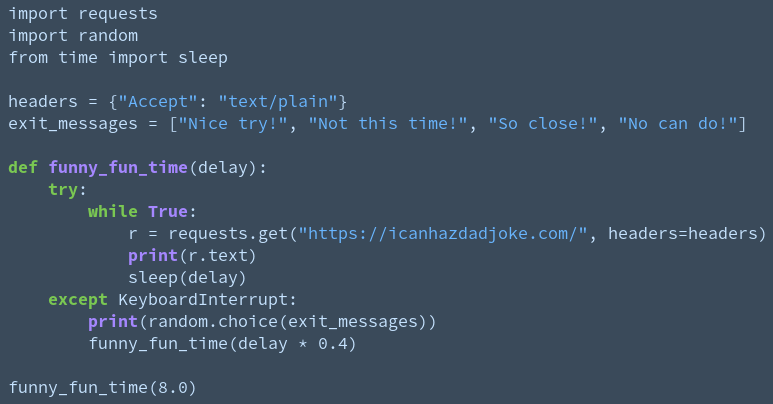
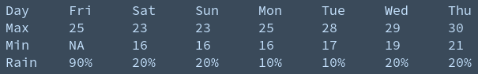
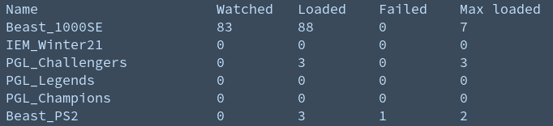

# My learning journey

Welcome to my learning journey! Here is a summary of the progress I've made so far towards my career in software development.

## [funny-fun-time](https://github.com/StephenAppleby/funny-fun-time)

My first Python script. After working my way through the [official Python tutorial](https://docs.python.org/3/tutorial/), I decided to consolodiate my understanding with this very simple script.

Using the requests module, it fetches a dad joke from icanhazdadjoke.com then prints one joke per line every 8 seconds indefinitely. If the user attempts to exit, the script catches the KeyboardInterrupt, halves the delay between jokes and continues. Crude but fun

##### Skills/tools:
- Python fundamentals
- The basics of the requests library
- Basic exception handling

### bomfc

The Beureau Of Meteriology ForeCast script was a simple tool I made for myself to print the weather to the terminal for me every morning.

The first step is to extract the xml file from the BOM FTP server using the ftplib module. Then the xml is parsed using the xml.etree.ElementTree class and extracting the desired information. This information is then formatted and printed to the console. Simple but useful

##### Skills/tools:
- ftplib
- xml parsing basics
- string formatting

### vidman

Another personal project to help me manage my video downloads. vidman is a wrapper for youtube-dl and aria2c.

Using the argparse module, I created an interface with several subparsers for commands for adding, editing and deleting Youtube playlists, loading videos with youtube-dl until the playlist folder is full, loading all playlists and deleting videos when watched. It was a great exercise in consolidating my basic Python skills as well as gaining a comfortable familiarity with json parsing and the pathlib module. I use it every day

##### Skills/tools:
- pathlib
- json parsing
- basic subprocess usage
- argparse

## 

After decided to reinforce some of my computer science fundamtentals, I began compiling a collection of common data structures and algorithms. This is a work in progress and I plan to continue adding to it as I feel I need to further my understanding in the future.

### Highlight: AVL tree

The most complex data structure implemented here is the AVL tree. An AVL tree is a type of self-balancing binary search tree, first designed by Adelson-Velsky and Landis. The issue of maintaining the balance of a binary search tree (bst) is important as the O = log(n) lookup time for a bst, it's greatest advantage, can only be guaranteed if the tree is balanced.

##### BST traversal

First, to understand insertion and deletion algorithms for the AVL tree, we need to understand how to traverse a binary search tree in order to find a given key.

We do this by comparing the key of the root node to the key we are looking for. If key == root.key then we have found the node we are searching for and can return. If key < root.key, we perform the same process on root.left and if key > root.key, we go to root.right instead.

	def search(node, key):
		if key == node.key:
			return node
		if key < node.key:
			return search(node.left)
		if key > node.key:
			return search(node.right)

##### Insertion

The insertion and deletion algorithms for the AVL tree can be best understood in terms of this common recursive binary tree function design pattern:

1. Receive node as argument
2. Check if base case and if so, do something to the node and return the node
3. If condition: node.child = recur(node.child) for one or both children
4. Do something to node
5. Return node

The base case for the insertion algorithm is when we find a missing space in the tree while searching using our bst traversal stated above.

Once we have our base case, we make our way back up the tree, replacing the child with the altered node returned by the recursive function each time.

Now comes time for the self-balancing secret sauce. If the subtree (whose root is the node we are up to in the function) is unbalanced, we perform a balance operation consisting of a tree rotation (see [this article](https://www.programiz.com/dsa/avl-tree) for details on how to implement this) and return the resulting, balanced subtree.
	
	def balance(node):
		balance_factor = node.left.height - node.right.height
		if balance_factor < -1 or balance_factor > 1:
			node = node.perform_relevant_rotation()

	1.
	def insert(node, key):
		2.
		if key < node.key and node.left == None:
			node.left = Node(key)
			return node
		if key > node.key and node.right == None:
			node.right = Node(key)
			return node
		3.
		if key < node.key:
			node.left = insert(node.left, key)
		if key > node.key:
			node.right = insert(node.right, key)
		4.
		node = balance(node)
		5.
		return node

##### Deletion

For deletion operations, the process is exactly the same except for step 2. Firstly, the base case for deletion is when key == node.key.

Once we have found the node to be deleted, what we do next depends on how many children the node to be deleted has.

###### No children

Simply return `None`.

###### One child

Simply return the child.

###### Two children

In this case we have to find the in-order successor of the node to be deleted.

The in-order successor is the node in the tree with the next highest value and can be calculated by going to the right child of the node, then continuing left down the chain until we find a node which has no left child.

Once we have found the successor, we need to make sure that it's right child is detached from it if it has one and attached to the successor's parent in place of the successor.

After removing the successor from it's previous place, we pass it back up to the place of the node to be deleted. As we have rearranged the tree when we removed the successor, we need to make sure that the tree is balanced at each stage as we travel back up the tree to the node to be removed.

We then assign the left child of the node to be deleted to the left side of the successor, assign the subtree we have just removed the successor from to the successor's right side, and return the successor back up the chain to replace the node to be deleted.

Lastly, we follow the last two steps for the insertion algorithm, balancing each node as we go back up the chain and returning the balanced node.

	def get_successor(node):
		if node.left == None:
			right_child = node.right
			node.right = None
			return node, right_child
		successor, subtree = get_successor(node.left)
		node.left = subtree
		node = balance(node)
		return successor, node

	1.
	def delete(node, key):
		2.
		if key == node.key:
			if node.children == 0:
				return None
			if node.children == 1:
				return node.child
			if node.children == 2:
				successor, right_child = get_successor(node)
				successor.left = node.left
				successor.right = right_child
				successor = balance(successor)
				return successor
		3. 
		if key < node.key:
			node.left = delete(node.left, key)
		if key > node.key:
			node.right = delete(node.right, key)
		4.
		node = balance(node)
		5.
		return node

These are the basic operations for building an AVL tree.

##### Visualising binary trees

The binary tree can be rendered to the console with the display() method. The logic for this implementation can be found in ./util/util.py.

Example:

    >>> tree = BinaryTree().preset(7)
    >>> tree.display()
           0
       ┌───┴───┐
       1       2
     ┌─┴─┐   ┌─┴─┐
     3   4   5   6

The project also includes a visualising tool for AVL trees. This tool runs in the console and shows a series of slides demonstrating the steps taken for adding and deleting nodes from an AVL tree. Running the script in src/avlslideshow.py will run an infinite sequence while the script in src/avl_gif.py produces the looping sequence shown in the gif above.

##### Skills/tools:
- Recognising the pros and cons of different types of data structures
- Understanding the difference between different degrees of computational complexity (eg. 0 = n lookup for a list vs O = log(n) for a binary search tree)
- Object oriented programming including working with base classes and single inheritance
- Working with recursive data structures and algorithms, identifying base cases and trouble-shooting non-terminating sequences
- Unit testing with the `unittest` module
- Type hinting for documentation
- Commenting code for readability and clarity
- Documenting code with the `doq` module and code snippets

